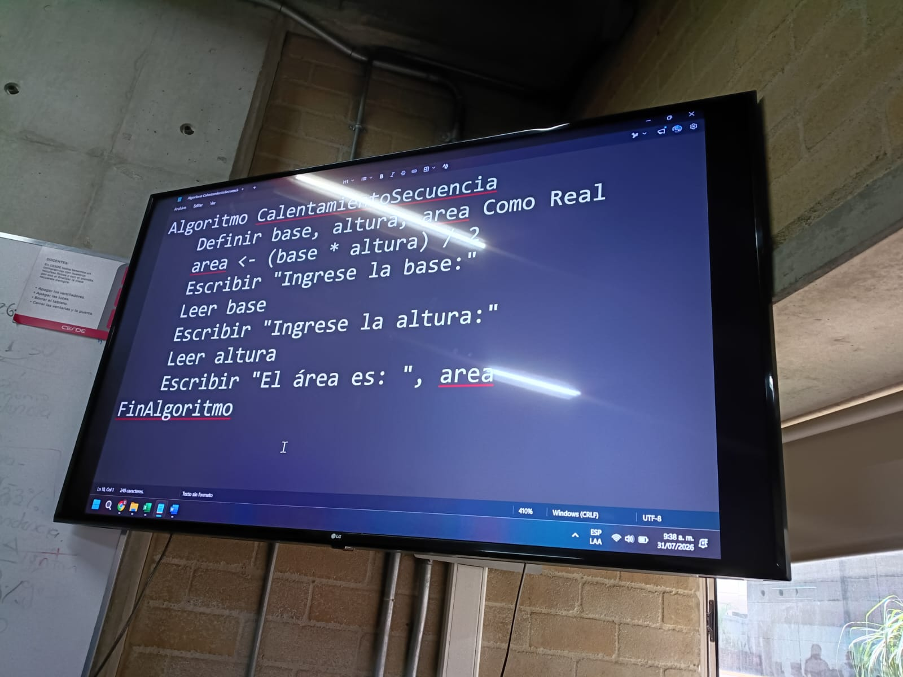
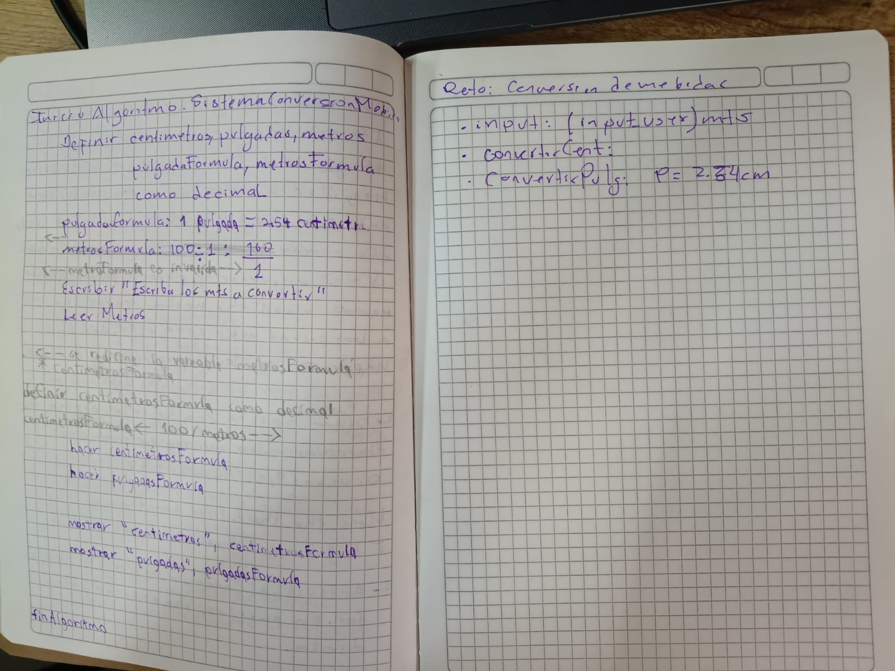

This was the discussion about the class on the week number 2.

It was a discussion about the followin picture, I am not going to discuss anymore about that I just post it.

Then, later we pass over another activity on pair, this time I share my notebook with classmate Jorge.

Then the teacher leaves a short exercice about to; calculate the perimeter of a circle.

Then he explain the basics commands of git on windows via git terminal.

