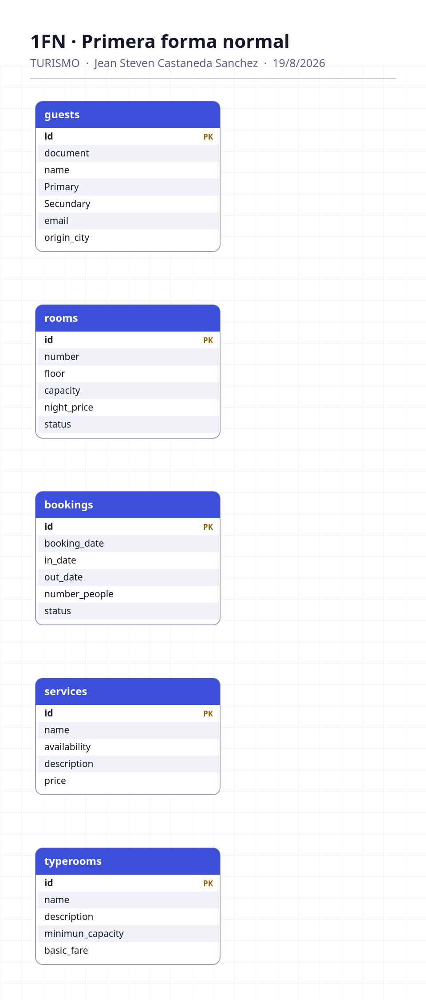
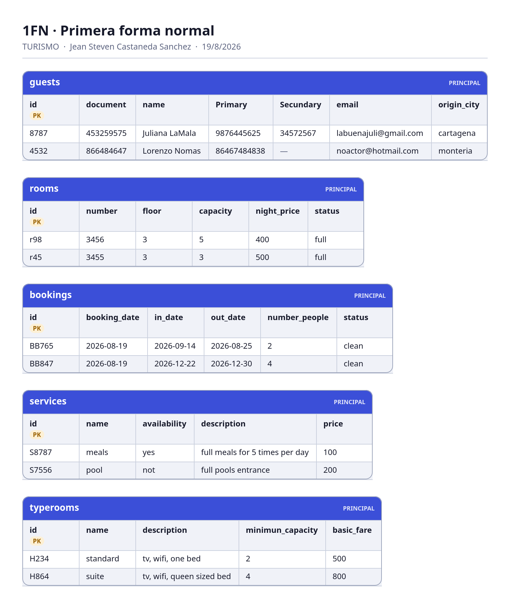
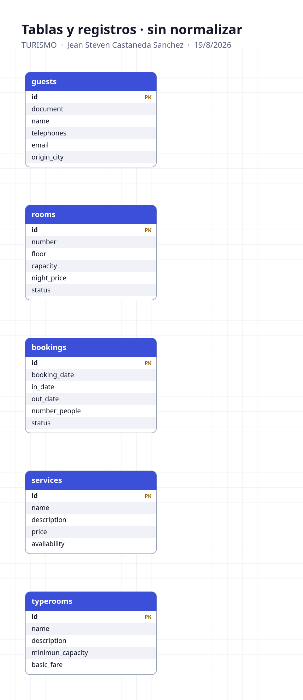
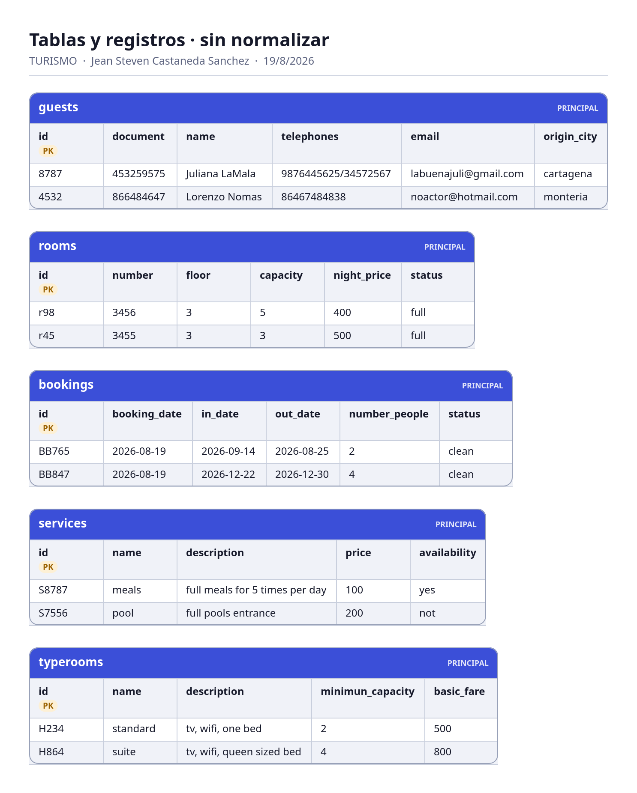

Today we are studying the relationships for the first and the second form to organize data bases.

Here there is the exercice we need to solve:

TURISMO

BD · JJG

jercicio: Sistema de gestión de un hotel en Santa Marta

Un hotel ubicado en Santa Marta, Colombia, necesita desarrollar una aplicación para administrar sus huéspedes, habitaciones y reservas. El hotel dispone de diferentes tipos de habitaciones y ofrece distintos servicios adicionales durante la estadía, algo habitual en la oferta hotelera de la ciudad.

A partir del levantamiento inicial se identificaron las siguientes 5 entidades:

Huésped

documento
nombre
teléfono
correo
ciudad_origen

Reserva

fecha_reserva
fecha_entrada
fecha_salida
número_personas
estado

Habitación

número
piso
capacidad
precio_noche
estado

Tipo_Habitación

nombre
descripción
capacidad_maxima
tarifa_base

Servicio

nombre
descripción
precio
disponibilidad
Relaciones
Un huésped puede realizar muchas reservas, pero cada reserva pertenece a un solo huésped.
Huésped 1 : N Reserva
Un tipo de habitación puede corresponder a muchas habitaciones, pero cada habitación pertenece a un solo tipo.
Tipo_Habitación 1 : N Habitación
Una habitación puede aparecer en diferentes reservas a lo largo del tiempo, pero cada reserva corresponde a una habitación.
Habitación 1 : N Reserva
Una reserva puede solicitar varios servicios y un mismo servicio puede ser solicitado en diferentes reservas.
Reserva N : M Servicio

Fecha de entrega: 2026-08-19

Exercices made on the classRoom:

[Exercice](assets/TallerdeNormalizacióndeBasesdeDatos001.pdf)

[Exercice](assets/TallerdeNormalizacióndeBasesdeDatos002.pdf)

[Exercice](assets/TallerdeNormalizacióndeBasesdeDatos003.pdf)

Today's lesson is the first assesment.
